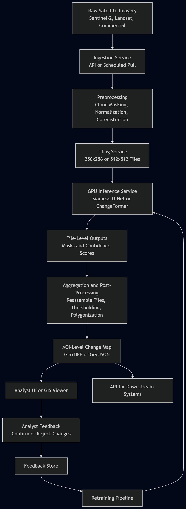

# 1. Problem Statement

## 1.1 Business Problem
Government analysts and mission planners need timely, accurate insights into how physical environments change over time.  These changes can be new construction, equipment movement, land disturbance, or infrastructure degradation. Manual review of satellite imagery is slow, inconsistent, and does not scale to the volume of modern multispectral and high‑resolution imagery.

A change detection system would automatically identify, highlight, and prioritize areas of interest (AOIs) where meaningful changes have occurred between two or more satellite images. This reduces analyst workload, accelerates intelligence cycles, and improves situational awareness for national security, disaster response, and operational planning.

## 1.2 ML Problem Framing
This is fundamentally a **pixel‑level change detection** problem using remote sensing data. The ML task can be framed as:

- **Binary segmentation** (changed vs. unchanged pixels), or  
- **Semantic change detection** (classifying the type of change), or  
- **Object‑level change detection** (detecting new or removed objects)

The system must handle:

- Multispectral inputs (e.g., Sentinel‑2, Landsat 8/9)  
- Varying resolutions  
- Atmospheric differences  
- Seasonal variation  
- Cloud cover and shadows  

ML is appropriate because:

- Rule‑based methods fail under environmental variability  
- Analysts cannot manually inspect all imagery  
- Deep learning models (U‑Net, Siamese networks, transformers) outperform classical methods  
- Change detection benefits from learned spatial + spectral representations  

## 1.3 Success Criteria

### Business Success Criteria
- Reduce analyst review time by **≥ 40%**  
- Increase detection of mission‑relevant changes by **≥ 25%**  
- Deliver change maps within **< 5 minutes** of imagery ingestion  
- Improve prioritization of AOIs for downstream analysis  

### Product Success Criteria
- Analysts can quickly visualize changes with minimal false alarms  
- System integrates cleanly with existing GEOINT workflows  
- Change overlays are interpretable and exportable  
- Supports batch and on‑demand analysis  

### ML Success Criteria (Offline)
- F1 score ≥ 0.80 on change vs. no‑change segmentation  
- IoU ≥ 0.75 for changed regions  
- Low false‑positive rate in areas with vegetation or seasonal variation  

### ML Success Criteria (Online / Operational)
- P95 inference latency < 1 second per tile  
- End‑to‑end pipeline latency < 5 minutes  
- Drift detection triggers when spectral distributions shift  
- Cloud/shadow masking accuracy ≥ 90%  

# 2. Requirements

## 2.1 Functional Requirements

### Core System Capabilities
- Ingest multispectral satellite imagery from sources such as Sentinel‑2, Landsat 8/9, or commercial providers.
- Preprocess imagery (cloud masking, atmospheric correction, normalization).
- Align and co‑register images from different timestamps.
- Detect and segment areas of change between two or more images.
- Generate change maps and confidence scores.
- Provide visual overlays for analysts (e.g., heatmaps, binary masks).
- Allow analysts to download or export change detection results.
- Support both batch processing (large AOIs) and on‑demand tile‑level analysis.

### User Interactions
- Analysts can submit AOIs or upload imagery pairs.
- Analysts can view change maps through a UI or GIS tool.
- Analysts can filter changes by threshold, type, or confidence.
- Analysts can provide feedback (e.g., confirm or reject detected changes).

### System Behaviors
- Automatically queue and process new imagery as it becomes available.
- Trigger alerts when significant changes exceed predefined thresholds.
- Log all predictions, metadata, and system events for auditing.

---

## 2.2 Non‑Functional Requirements

### Performance
- **Inference latency:** P95 < 1 second per 512×512 tile.
- **End‑to‑end pipeline latency:** < 5 minutes for a typical AOI.
- **Throughput:** Must support processing thousands of tiles per hour.

### Scalability
- Horizontal scaling for inference workloads.
- Ability to handle spikes in imagery ingestion (e.g., post‑event surges).
- Efficient tiling and parallelization for large AOIs.

### Reliability & Availability
- Target availability: **99.5%** for inference services.
- Automatic retries for failed tiles.
- Graceful degradation when upstream imagery sources are delayed.

### Accuracy & Robustness
- Must handle seasonal variation, vegetation changes, and lighting differences.
- Cloud/shadow masking must achieve ≥ 90% accuracy.
- False positives must be minimized in rural or vegetated areas.

### Security & Compliance
- All imagery must be stored and processed in secure environments.
- Access control for sensitive or classified imagery.
- Audit logs for all user actions and model outputs.

### Interpretability
- Change maps must be explainable and visually interpretable.
- Provide per‑pixel or per‑region confidence scores.
- Allow analysts to inspect before/after imagery side‑by‑side.

### Cost Constraints
- Optimize GPU usage for inference.
- Use spot instances or autoscaling where possible.
- Minimize storage costs through tiling and compression.

---

## 2.3 Constraints & Assumptions

### Constraints
- Imagery may have inconsistent resolution, cloud cover, or acquisition angles.
- Some AOIs may have limited labeled data for supervised training.
- Processing must work even when metadata (e.g., sun angle) is incomplete.
- Must support both multispectral and RGB imagery.

### Assumptions
- Imagery sources provide consistent georeferencing.
- Analysts have access to a GIS viewer or internal UI.
- Cloud masking models or algorithms are available.
- Sufficient compute resources (CPU/GPU) are provisioned for inference.

# 3. Data

## 3.1 Data Sources

### Primary Imagery Sources
- **Sentinel‑2 (ESA)**  
  - 10m resolution multispectral imagery  
  - Free and globally available  
  - Useful for broad‑area change detection  

- **Landsat 8/9 (USGS/NASA)**  
  - 30m resolution multispectral imagery  
  - Long historical archive for temporal analysis  

- **Commercial High‑Resolution Imagery (e.g., Maxar, Planet)**  
  - 0.3m–3m resolution  
  - Ideal for fine‑grained object‑level change detection  

### Supporting Data Sources
- **Digital Elevation Models (DEMs)** for terrain correction  
- **Cloud masks** (Sentinel‑2 Scene Classification Layer or custom models)  
- **Metadata** (sun angle, acquisition time, sensor type)  
- **Land cover datasets** (e.g., ESA WorldCover) for contextual filtering  

### Optional Sources
- **SAR imagery (Sentinel‑1)** for all‑weather, day/night change detection  
- **OpenStreetMap** for contextual overlays  
- **Weather data** for atmospheric correction  

---

## 3.2 Data Characteristics

### Spatial Characteristics
- Varying resolutions (10m, 30m, sub‑meter)  
- Georeferenced raster data (UTM or WGS84)  
- Large file sizes requiring tiling  

### Spectral Characteristics
- Multispectral bands (RGB, NIR, SWIR)  
- Spectral signatures vary by season, vegetation, and sensor  

### Temporal Characteristics
- Irregular revisit times  
- Seasonal variation  
- Cloud cover and shadows affecting usability  

### Quality Considerations
- Cloud contamination  
- Misalignment between timestamps  
- Atmospheric distortion  
- Sensor noise  
- Missing metadata  

### Label Availability
- Limited labeled change detection datasets  
- Labels often require manual annotation by analysts  
- Weak supervision or self‑supervised methods may be needed  

---

## 3.3 Data Pipeline

### 1. **Ingestion**
- Pull imagery from APIs (Copernicus, USGS, commercial providers)  
- Validate metadata and georeferencing  
- Store raw imagery in object storage (e.g., Azure Blob Storage)  

### 2. **Preprocessing**
- Atmospheric correction (e.g., Sen2Cor)  
- Cloud and shadow masking  
- Radiometric normalization  
- Co‑registration of before/after images  
- Resampling to a common resolution  

### 3. **Tiling**
- Split large scenes into 256×256 or 512×512 tiles  
- Maintain tile indexing and geospatial metadata  
- Filter out tiles with excessive cloud cover  

### 4. **Feature Engineering**
- Compute spectral indices (NDVI, NBR, NDWI)  
- Normalize band values  
- Create temporal difference features (Δ bands, Δ indices)  
- Optional: texture features or SAR backscatter features  

### 5. **Label Processing**
- Convert polygon labels to raster masks  
- Align labels with tiled imagery  
- Handle class imbalance (changed vs. unchanged)  

### 6. **Storage**
- Store processed tiles in a versioned dataset  
- Maintain metadata for traceability (sensor, date, cloud %, tile ID)  
- Use a feature store if integrating with downstream models  

### 7. **Data Validation**
- Schema checks (band count, resolution)  
- Distribution checks (spectral histograms)  
- Drift detection for incoming imagery  

---

## 3.4 Data Challenges & Mitigations

### Challenge: Cloud cover and shadows  
**Mitigation:** Cloud masking models, temporal filtering, SAR fallback.

### Challenge: Seasonal variation  
**Mitigation:** Use spectral indices, normalize across seasons, train with diverse samples.

### Challenge: Misalignment between timestamps  
**Mitigation:** Automated co‑registration using feature matching or optical flow.

### Challenge: Limited labeled data  
**Mitigation:**  
- Self‑supervised pretraining  
- Weak supervision  
- Synthetic label generation  
- Active learning with analyst feedback  

### Challenge: Large data volumes  
**Mitigation:**  
- Tiling + parallel processing  
- On‑demand loading  
- Efficient storage formats (COG, Zarr)  

# 4. Modeling

## 4.1 Model Selection

### Candidate Model Families
- **Siamese CNNs / Siamese U‑Net**
  - Two-branch architecture comparing before/after images.
  - Strong baseline for binary change detection.
  - Good when training data is limited.

- **U‑Net / U‑Net++ (Single-Stream)**
  - Concatenate before/after images as channels.
  - Simple, effective, widely used in remote sensing.

- **Change Detection Transformers (CDT, BIT, ChangeFormer)**
  - Capture long-range spatial dependencies.
  - More robust to seasonal and illumination changes.
  - State-of-the-art performance on many benchmarks.

- **Hybrid Models (CNN + Transformer)**
  - CNN for local texture + Transformer for global context.
  - Best for high-resolution imagery.

### Recommended Model Choice
**ChangeFormer or a Siamese U‑Net**, depending on compute and data availability:

- **Siamese U‑Net** → easier to train, good for limited labels.  
- **ChangeFormer** → best performance, handles multispectral data well, more robust to noise.

---

## 4.2 Training Pipeline

### 1. **Data Preprocessing**
- Normalize spectral bands.
- Apply cloud/shadow masks.
- Align before/after images (co-registration).
- Tile into 256×256 or 512×512 patches.

### 2. **Feature Engineering**
- Compute spectral indices (NDVI, NBR, NDWI).
- Compute temporal differences (Δ bands, Δ indices).
- Optional: add SAR channels for robustness.

### 3. **Training Loop**
- Use weighted cross-entropy or focal loss to handle class imbalance.
- Apply strong data augmentation:
  - Random rotations, flips, crops.
  - Brightness/contrast jitter.
  - Synthetic cloud overlays (optional).
- Use early stopping based on validation IoU.

### 4. **Hyperparameter Tuning**
- Learning rate (1e‑3 → 1e‑5 range).
- Batch size (depends on GPU memory).
- Loss function variants (Dice loss, BCE+Dice).
- Model depth and number of filters.

### 5. **Validation Strategy**
- Temporal split: train on older imagery, validate on newer.
- Geographic split: ensure AOIs do not overlap between train/val.
- Evaluate on diverse seasons and terrain types.

---

## 4.3 Evaluation

### Offline Metrics (Model-Centric)
- **IoU (Intersection over Union)** — primary metric for segmentation.
- **F1 Score** — balances precision/recall for change vs. no-change.
- **Precision/Recall** — important for minimizing false positives.
- **AUC‑PR** — useful for imbalanced datasets.

### Online Metrics (Production-Centric)
- **P95 inference latency** per tile.
- **Error rate** (failed tiles, corrupted inputs).
- **Throughput** (tiles processed per minute).
- **Cloud mask accuracy** (if using ML-based masking).

### Business Metrics
- Reduction in analyst review time.
- Increase in detection of mission-relevant changes.
- Reduction in false alarms in operational workflows.

---

## 4.4 Model Selection Tradeoffs

### Siamese U‑Net
**Pros:**
- Simple, interpretable.
- Good with limited labels.
- Fast inference.

**Cons:**
- Struggles with large spatial context.
- Less robust to seasonal variation.

### ChangeFormer / Transformer-Based Models
**Pros:**
- Best performance on modern benchmarks.
- Handles global context and spectral variation.
- More robust to noise and misalignment.

**Cons:**
- Higher compute cost.
- Requires more training data.
- Longer inference times.

### Hybrid CNN + Transformer
**Pros:**
- Balanced performance and efficiency.
- Good for high-resolution imagery.

**Cons:**
- More complex to implement and tune.

---

## 4.5 Model Output Format

The model outputs:
- **Binary mask** (changed vs. unchanged pixels)
- **Confidence map** (0–1 per pixel)
- **Optional semantic labels** (type of change)
- **Metadata** (tile ID, timestamp, sensor, cloud %)

These outputs feed directly into:
- Visualization layers
- Analyst review tools
- Alerting systems
- Monitoring dashboards

# 5. Serving & Deployment

## 5.1 Inference Architecture

### Real‑Time (On‑Demand) Inference
Used when analysts submit AOIs or imagery pairs manually.

- API endpoint receives AOI or imagery tiles.
- Preprocessing pipeline (cloud masking, normalization, co‑registration) runs on CPU.
- Model inference runs on GPU (Siamese U‑Net or ChangeFormer).
- Outputs (change mask + confidence map) returned synchronously or via callback.
- Suitable for small AOIs or urgent analysis tasks.

### Batch Inference
Used for large‑scale monitoring or automated ingestion.

- New imagery triggers a batch job (event‑driven).
- Imagery is tiled and queued for parallel processing.
- Distributed workers perform preprocessing + inference.
- Results are aggregated into AOI‑level change maps.
- Suitable for wide‑area surveillance or routine monitoring.

### Recommended Architecture
A **hybrid** approach:
- Real‑time inference for analyst‑driven tasks.
- Batch inference for automated monitoring pipelines.

---

## 5.2 Scaling Strategy

### Horizontal Scaling
- Multiple GPU workers process tiles in parallel.
- Autoscaling based on queue depth or incoming imagery volume.

### Tiling‑Based Parallelism
- Each tile is processed independently.
- Enables embarrassingly parallel workloads.
- Supports distributed inference across many nodes.

### Caching
- Cache preprocessed tiles to avoid repeated normalization or cloud masking.
- Cache embeddings (for Siamese models) to speed up repeated comparisons.

### Load Balancing
- Route inference requests across GPU nodes.
- Prioritize real‑time requests over batch jobs.

---

## 5.3 Deployment Strategy

### Containerization
- Package preprocessing + inference in Docker containers.
- Ensures reproducibility across environments.

### Deployment Options
- **GPU‑enabled Kubernetes cluster** (recommended)
  - Autoscaling
  - Rolling updates
  - Resource isolation
- **Serverless GPU endpoints** (if available)
  - Simplifies scaling
  - Higher cost per inference
- **Edge deployment** (optional)
  - For tactical or disconnected environments
  - Requires lightweight models

### Deployment Patterns

#### Blue/Green Deployment
- Deploy new model version alongside the old one.
- Switch traffic once validated.

#### Canary Deployment
- Send a small percentage of tiles to the new model.
- Monitor drift, latency, and error rates.

#### Shadow Deployment
- New model runs in parallel but does not affect analyst outputs.
- Ideal for validating new architectures (e.g., ChangeFormer → Hybrid Transformer).

#### A/B Testing
- Compare model variants on:
  - IoU
  - False positives
  - Analyst feedback
  - Latency

---

## 5.4 Pipeline Orchestration

### Workflow Orchestration Tools
- Airflow, Prefect, Dagster, or Azure ML pipelines.

### Responsibilities
- Schedule batch jobs.
- Manage retries for failed tiles.
- Track lineage (imagery → tiles → predictions).
- Trigger downstream alerts or notifications.

---

## 5.5 Model Registry & Versioning

### Model Registry
- Store model versions, metadata, and evaluation metrics.
- Track:
  - Training dataset version
  - Hyperparameters
  - Performance metrics
  - Deployment history

### Versioning Strategy
- Semantic versioning (e.g., v1.2.0).
- Promote models from staging → production after validation.

---

## 5.6 Output Delivery

### Output Formats
- Binary change mask (GeoTIFF)
- Confidence map (float raster)
- Vectorized polygons (GeoJSON)
- Metadata (sensor, timestamps, cloud %, model version)

### Delivery Channels
- Analyst UI or GIS viewer
- API for downstream systems
- Secure file export (GeoTIFF/COG)
- Event notifications for significant changes

---

## 5.7 Security & Access Control

- Enforce role‑based access control (RBAC).
- Encrypt imagery and outputs at rest and in transit.
- Maintain audit logs for all inference requests.
- Ensure compliance with GEOINT and national security standards.

# 6. Monitoring & Observability

## 6.1 Model Monitoring

### Data Drift Monitoring
Track changes in the input data distribution:
- Spectral band histograms (per band, per tile)
- NDVI/NBR distribution shifts
- Seasonal variation patterns
- Cloud/shadow mask drift
- Sensor changes (Sentinel‑2A vs 2B, Landsat 8 vs 9)

Trigger alerts when:
- KL divergence or PSI exceeds thresholds
- Cloud mask accuracy drops
- Spectral signatures deviate from historical norms

### Concept Drift Monitoring
Track changes in the relationship between inputs and outputs:
- Degradation in IoU or F1 on a labeled validation stream
- Increased false positives in vegetation or urban areas
- Analyst feedback indicating incorrect detections

### Prediction Monitoring
Monitor:
- Prediction confidence distribution
- Change mask sparsity/density
- Tile‑level anomaly rates
- Sudden spikes in detected changes (possible false alarms)

---

## 6.2 System Monitoring

### Performance Metrics
- **Inference latency** (P50, P90, P95, P99)
- **Throughput** (tiles/minute)
- **Queue depth** for batch jobs
- **GPU utilization** (target 60–80%)
- **CPU/memory usage** for preprocessing

### Reliability Metrics
- Tile failure rate
- Retry count
- API error rate (4xx, 5xx)
- Pipeline success/failure ratio

### Availability Metrics
- Uptime of inference service (target 99.5%)
- Health checks for GPU nodes
- Orchestrator job success rate

---

## 6.3 Alerting

### Alert Categories
- **Critical Alerts**
  - Inference service down
  - GPU node failure
  - Pipeline stuck or queue depth > threshold
  - Severe data drift detected

- **Warning Alerts**
  - Latency degradation (P95 > 1s)
  - Increased false positives in analyst feedback
  - Cloud mask accuracy drop
  - Storage nearing capacity

- **Informational Alerts**
  - New imagery source added
  - Model version updated
  - Batch job completed

### Alert Delivery
- Email or Slack notifications to engineering + analyst teams
- Integration with monitoring dashboards (Grafana, Azure Monitor)
- PagerDuty for critical alerts

---

## 6.4 Logging

### Log Types
- **Inference logs**  
  - Tile ID, timestamps, model version, latency, confidence stats

- **Preprocessing logs**  
  - Cloud mask results, co‑registration metrics, normalization parameters

- **System logs**  
  - API requests, errors, retries, resource usage

- **Audit logs**  
  - User actions, downloads, feedback, model overrides

### Log Retention
- Short‑term (7–30 days): detailed logs  
- Long‑term (6–12 months): aggregated logs for compliance  

---

## 6.5 Dashboards

### Recommended Dashboards
- **Model performance dashboard**
  - IoU, F1, precision/recall over time
  - Drift indicators
  - Analyst feedback trends

- **System health dashboard**
  - Latency percentiles
  - GPU/CPU utilization
  - Queue depth
  - Error rates

- **Data quality dashboard**
  - Cloud cover distribution
  - Spectral drift
  - Tile rejection rates

- **Operational dashboard**
  - Batch job status
  - AOIs processed per day
  - Storage usage

---

## 6.6 Human-in-the-Loop Feedback

### Analyst Feedback Loop
- Analysts can confirm or reject detected changes.
- Feedback is logged and used for:
  - Retraining
  - Threshold tuning
  - Reducing false positives

### Active Learning
- Prioritize uncertain or low‑confidence tiles for annotation.
- Improve model performance with minimal labeling effort.

---

## 6.7 Monitoring Challenges & Mitigations

### Challenge: Seasonal drift causing false positives  
**Mitigation:** Seasonal normalization, temporal models, drift thresholds.

### Challenge: Cloud/shadow artifacts  
**Mitigation:** Improved cloud masking, SAR fallback, confidence filtering.

### Challenge: High false positives in vegetation  
**Mitigation:** Land cover filtering, vegetation‑specific thresholds.

### Challenge: Model degradation over time  
**Mitigation:** Continuous monitoring + scheduled retraining.

# 7. Retraining & Lifecycle Management

## 7.1 Retraining Triggers

### Data‑Driven Triggers
- **Spectral drift** detected in incoming imagery (KL divergence, PSI).
- **Cloud mask degradation** (accuracy drop or increased false positives).
- **Seasonal shifts** causing performance degradation.
- **New sensors or imagery sources** introduced (e.g., Sentinel‑2C).

### Performance‑Driven Triggers
- IoU or F1 score drops below defined thresholds.
- Increase in false positives in vegetation or urban areas.
- Analyst feedback indicates systematic errors.
- Latency increases due to model complexity or infrastructure changes.

### Time‑Based Triggers
- Scheduled retraining every **3–6 months**.
- Seasonal retraining cycles (e.g., winter vs. summer models).
- Periodic refresh to incorporate new AOIs or mission priorities.

---

## 7.2 Model Versioning

### Versioning Strategy
- Use **semantic versioning** (e.g., v1.3.0).
- Track:
  - Training dataset version
  - Preprocessing pipeline version
  - Hyperparameters
  - Model architecture
  - Evaluation metrics
  - Deployment history

### Model Registry
A centralized registry stores:
- Model binaries
- Metadata (sensor types, training dates, dataset versions)
- Evaluation reports
- Drift metrics
- Rollback history

Examples: Azure ML Model Registry, MLflow, or internal registry.

---

## 7.3 Continuous Training (CT)

### When CT Is Appropriate
- High‑frequency imagery ingestion (daily or weekly).
- Rapidly changing environments (construction, disaster zones).
- Systems with strong analyst feedback loops.

### CT Pipeline Components
- Automated data ingestion + validation.
- Automated labeling or weak supervision (if available).
- Scheduled retraining jobs.
- Automated evaluation against baseline models.
- Canary or shadow deployment for safety.

### Safeguards
- Human approval required before promoting CT‑trained models.
- Drift thresholds must be met before retraining is triggered.
- Rollback must be available at all times.

---

## 7.4 Rollback Strategy

### Rollback Triggers
- Latency regression.
- Increased false positives or false negatives.
- Analyst complaints or negative feedback.
- Data quality issues discovered post‑deployment.

### Rollback Mechanism
- Maintain at least **two production‑ready models**:
  - Current model
  - Last known good model
- Use blue/green or canary deployment to switch traffic.
- Rollback must complete within minutes.

---

## 7.5 Lifecycle Governance

### Documentation Requirements
- Model cards for each version.
- Dataset documentation (provenance, preprocessing, limitations).
- Change logs for each deployment.
- Risk assessments for new architectures.

### Compliance Requirements
- Audit logs for all inference requests.
- Traceability from input imagery → model → output.
- Secure storage of training data and model artifacts.

### Ownership
- **ML team:** model development, evaluation, retraining.
- **Platform team:** infrastructure, scaling, monitoring.
- **Analyst team:** feedback, validation, operational acceptance.

---

## 7.6 End‑of‑Life (EOL) Management

### When to Retire a Model
- New architecture significantly outperforms the old one.
- Sensor changes make old models obsolete.
- Mission requirements shift (e.g., new AOI types).
- Operational cost becomes too high.

### EOL Steps
- Archive model artifacts and metadata.
- Remove from active registry.
- Update documentation and dashboards.
- Notify downstream systems and analyst teams.

# 8. Risks & Tradeoffs

## 8.1 Technical Risks

### Model Sensitivity to Environmental Variation
- Seasonal changes, vegetation cycles, and lighting differences can cause false positives.
- Snow, flooding, or agricultural activity may appear as “change” even when not mission‑relevant.

**Mitigation:**  
Seasonal normalization, spectral indices, transformer-based models, and diverse training data.

### Cloud and Shadow Artifacts
- Cloud cover can obscure true changes or create false detections.
- Shadows from buildings or terrain can mimic structural changes.

**Mitigation:**  
Cloud/shadow masking, SAR fallback, confidence filtering.

### Misalignment Between Timestamps
- Even small geospatial misalignments can produce large false-positive regions.

**Mitigation:**  
Automated co‑registration, optical flow alignment, robust architectures.

### Limited Labeled Data
- High-quality change detection labels are expensive and time-consuming to produce.

**Mitigation:**  
Weak supervision, self-supervised pretraining, active learning, synthetic label generation.

---

## 8.2 Data Risks

### Sensor Inconsistency
- Differences between Sentinel‑2A/2B or Landsat 8/9 can shift spectral signatures.

**Mitigation:**  
Sensor-specific normalization, metadata-aware models.

### Data Gaps or Missing Metadata
- Missing sun angle, acquisition time, or cloud masks reduce model reliability.

**Mitigation:**  
Fallback defaults, metadata imputation, robust preprocessing.

### Large Data Volumes
- High-resolution imagery can exceed storage or processing capacity.

**Mitigation:**  
Tiling, compression (COG/Zarr), distributed processing.

---

## 8.3 Operational Risks

### Latency Spikes
- GPU contention or large AOIs can cause inference delays.

**Mitigation:**  
Autoscaling, queue prioritization, caching preprocessed tiles.

### Pipeline Failures
- Preprocessing steps (cloud masking, co‑registration) may fail silently.

**Mitigation:**  
Strict validation, retry logic, pipeline observability.

### Analyst Trust
- High false positives reduce trust and adoption.

**Mitigation:**  
Confidence maps, interpretable overlays, human‑in‑the‑loop feedback.

---

## 8.4 Ethical & Mission Risks

### Over‑Reliance on Automated Detection
- Analysts may miss critical context if they rely solely on model outputs.

**Mitigation:**  
Human review workflows, uncertainty visualization.

### Bias Toward Certain Terrain Types
- Models may perform better in urban areas than rural or vegetated regions.

**Mitigation:**  
Balanced training data, terrain-aware evaluation.

### Misinterpretation of Change
- Not all detected changes are mission-relevant (e.g., seasonal farming activity).

**Mitigation:**  
Semantic change classification, analyst filtering tools.

---

## 8.5 Tradeoffs

### Accuracy vs. Latency
- Transformer-based models improve accuracy but increase inference time.

**Decision:**  
Use hybrid architecture or GPU autoscaling to balance both.

### Sensitivity vs. False Positives
- Lower thresholds detect more changes but increase analyst workload.

**Decision:**  
Tune thresholds per AOI type; allow analyst overrides.

### Batch vs. Real‑Time Processing
- Batch is cheaper and scalable; real-time is more responsive.

**Decision:**  
Hybrid approach: batch for routine monitoring, real-time for analyst-driven tasks.

### Model Complexity vs. Maintainability
- Advanced architectures perform better but are harder to maintain.

**Decision:**  
Start with a strong baseline (Siamese U‑Net), then graduate to ChangeFormer.

---

## 8.6 Residual Risks (Cannot Be Fully Eliminated)

- Extreme weather or cloud cover may still obscure changes.
- Sudden sensor outages or calibration shifts.
- Rare or novel change types not represented in training data.
- Operational environments with limited compute or bandwidth.

These risks must be acknowledged and managed through monitoring, retraining, and human oversight.

# 9. Architecture Diagram

## 9.1 System Overview

The Satellite Imagery Change Detection System consists of four major components:

1. **Data Ingestion & Preprocessing**
   - Fetches raw satellite imagery from Sentinel‑2, Landsat, or commercial providers.
   - Performs cloud masking, atmospheric correction, normalization, and co‑registration.
   - Tiles imagery into 256×256 or 512×512 patches.

2. **Model Inference Service**
   - Runs Siamese U‑Net or ChangeFormer on GPU.
   - Processes tiles in parallel.
   - Outputs binary change masks, confidence maps, and metadata.

3. **Post‑Processing & Aggregation**
   - Reassembles tiles into AOI‑level change maps.
   - Applies thresholding, smoothing, and polygonization.
   - Generates GeoTIFF/COG outputs and vector overlays.

4. **Delivery & Analyst Interface**
   - Provides results via API, GIS viewer, or internal UI.
   - Supports downloads, filtering, and human‑in‑the‑loop feedback.
   - Logs predictions and feedback for retraining.

---

## 9.2 Mermaid Architecture Diagram

# 10. Final Summary

This document presents a complete end‑to‑end system design for a **Satellite Imagery Change Detection System**, demonstrating the full lifecycle of a production‑grade ML system used in GEOINT and remote sensing workflows. The design covers business framing, data pipelines, modeling strategy, deployment architecture, monitoring, and long‑term lifecycle management.

The system addresses a critical mission need: enabling analysts to rapidly identify and prioritize meaningful changes across large geographic areas using multispectral and high‑resolution satellite imagery. By automating change detection, the system reduces analyst workload, accelerates intelligence cycles, and improves situational awareness for national security, disaster response, and operational planning.

Key strengths of the design include:

- **Clear business alignment**: The system directly supports analyst workflows and mission outcomes.
- **Robust data pipeline**: Handles multispectral imagery, cloud masking, co‑registration, tiling, and spectral normalization.
- **Modern modeling approach**: Incorporates state‑of‑the‑art architectures such as Siamese U‑Net and ChangeFormer.
- **Scalable deployment**: Supports both real‑time and batch inference using GPU‑accelerated microservices.
- **Comprehensive monitoring**: Tracks data drift, model performance, system health, and analyst feedback.
- **Lifecycle governance**: Defines retraining triggers, versioning, rollback, and continuous improvement processes.
- **Operational realism**: Incorporates GEOINT‑specific constraints such as cloud cover, seasonal variation, and sensor inconsistency.

This system design reflects senior‑level ML engineering and product thinking, demonstrating the ability to translate mission requirements into a scalable, reliable, and maintainable ML solution. It also establishes a strong foundation for future phases of the 26‑week learning plan, including RAG systems, agents, GEOINT modeling, and MLOps.

The architecture, tradeoffs, and lifecycle considerations outlined here provide a blueprint that can be adapted to real‑world GEOINT environments and expanded into a full portfolio project in later phases.